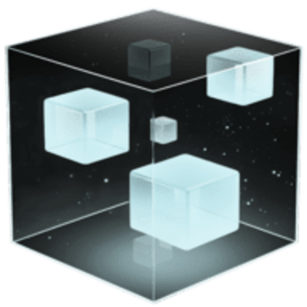

  
test

  

This is a c++ refactor of [https://github.com/Generlate/model_generator](https://github.com/Generlate/model_generator).

Example boxes are loaded from a directory, formatted into coordinate values, used to train the neural network and a .off box is exported.

## Directions

#### For the Model Generator

-   Download the repo (unzip if you downloaded the zipped file)
-   navigate to model_generator/build
-   from zsh, run `./model_generator`
-   this should generate a box in model_generator/assets/generated_boxes/ titled "generated_box.off"
-   this box can be viewed on websites like https://3dviewer.net/

-   in model_generator/datasets/austens_boxes/ you can find the training and testing datasets. These are filled with boxes, generated from a simpler, box generating algorithm.

## Dependencies

-   C++ Standard 2023
-   LibTorch 2.3.1
-   CMake 3.28.3
